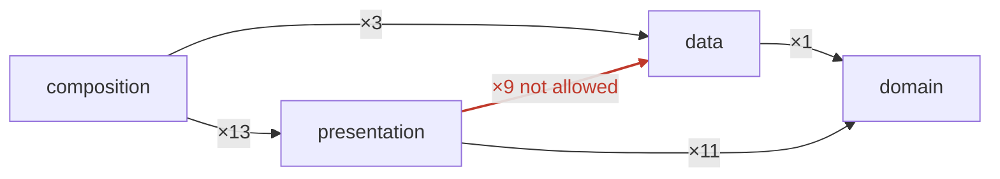

# keystone-swift

**keystone-swift examines the architecture of a Swift project.** The tool reads
the project and finds the layers in it. Then the tool applies the rules of each
layer to each file. You can run the tool from the command line, in continuous
integration (CI), and before an AI agent writes a file.

The tool gives the same result for the same files. No model makes the decision.
If the tool cannot apply a rule, it does not apply the rule. The tool does not
decide without evidence.

Each report of a violation gives you four items:

- the rule
- the location
- the correction
- the source of the rule

```
✗ restricted-symbols  28 violations  ·  4 distinct

  `presentation` uses `UserDefaults`, which this layer refuses  ×11
  DuckDuckGo/AutofillLoginListViewModel.swift:144
  DuckDuckGo/MainViewController.swift:124
  DuckDuckGo/PrivacyDashboard/PrivacyDashboardViewController.swift:47
  … and 8 more files

    A screen reaches the domain and never storage. Take the use case protocol
    through the initialiser. Let the composition root select the concrete type.

    Robert C. Martin, Clean Architecture (2017), Ch. 22 — The Dependency Rule.
```

---

## Contents

[What the tool does](#what-the-tool-does) ·
[What the tool reads](#what-the-tool-reads) ·
[How the tool gives a layer to each file](#how-the-tool-gives-a-layer-to-each-file) ·
[What the tool detects](#what-the-tool-detects) ·
[Installation](#installation) ·
[Commands](#commands) ·
[How to start on an old project](#how-to-start-on-an-old-project) ·
[Freeze and baseline](#freeze-and-how-it-differs-from-a-baseline) ·
[The configuration file](#the-configuration-file) ·
[Agents](#agents) ·
[Continuous integration](#continuous-integration) ·
[Compiler settings this tool requires](#compiler-settings-this-tool-requires) ·
[A SwiftLint config to go with it](#a-swiftlint-config-to-go-with-it) ·
[Evidence](#evidence) ·
[Limits](#limits) ·
[Licence](#licence) ·
[Sources](#sources)

---

## What the tool does

The Swift compiler stops a module when that module uses a symbol that access
control hides. This is a strong control. But the compiler cannot see the
difference between a screen and a business rule. Two types in one module are
equal to the compiler.

The compiler also does less than most people expect, and this tool has two
settings it needs you to turn on. See
[Compiler settings this tool requires](#compiler-settings-this-tool-requires).

keystone-swift adds that difference. The tool puts each file into a layer. Then
the tool applies the rules of that layer.

There are seven layers:

| Layer | What it holds |
| --- | --- |
| `domain` | Entities, use cases, and the contracts for them. The stable centre. |
| `data` | Repositories, clients, stores, and data transfer objects (DTOs). |
| `presentation` | Views and view models. |
| `composition` | The one place that knows each concrete type. Wiring only. |
| `library` | Utilities with no knowledge of the application. |
| `testSupport` | Doubles, drivers, and builders that test targets share. |
| `tests` | Test targets. |

The tool does not tell you to use these seven layers. The tool finds the layers
that your project has.

---

## What the tool reads

The tool reads the structure of the project. The tool does not need a
configuration file.

The tool reads these sources:

- **Swift package manifests.** The tool reads each `Package.swift` file. The
  tool finds each target and each product in the file. A manifest can calculate
  its list of targets. The tool also reads those targets.
- **Xcode projects.** The tool reads each `project.pbxproj` file. The tool finds
  the targets and the kind of each target.
- **Directory names.** A directory with the name `Domain`, `Data`, `UI` or
  `Tests` tells the tool what is in it.
- **The module graph.** The tool reads which module depends on which module.
- **The Swift source.** A parser reads each file. The tool does not use regular
  expressions. A type name in a comment or in a text string is not a
  declaration.

---

## How the tool gives a layer to each file

This is the most important part of the tool. Each rule is only as correct as the
layer that the tool gives to a file.

The tool applies seven tests in this sequence. The first test that gives an
answer is the answer.

1. **A path that the project declares.** The configuration file can give a path
   to a layer. This path wins against all other evidence.
2. **A path that contains the word "test".** A test can contain the code that it
   tests. So a driver that holds a fake store is still a test.
3. **The kind of the target.** A manifest that declares a `.testTarget` states a
   fact. An Xcode target of the kind "application" also states a fact. But the
   tool uses an application target only when most of the Swift files of the
   project are outside that target. A project with one target has no modules to
   connect, so that target is not the composition root.
4. **What the file declares itself to be.** Examples are a type that conforms to
   `View`, an `@main` attribute, and a subclass of `NSManagedObject`. The
   compiler examines a conformance, so a conformance stays correct.
5. **A directory name that states a layer.** A directory with the name `Domain`
   or `UI` shows a decision that a person made. The tool reads the directory
   names from the file to the root of the project. The nearest directory wins.
6. **The end of a directory name.** A module with the name `AuthUIDI` contains
   its layer in its name. The tool reads only the nearest directory.
7. **What the file uses.** Examples are an `import CoreData` statement and a
   `URLSession` symbol. This evidence is correct, but it is weaker than a
   conformance. So the tool reads it last.

If no test gives an answer, the file has no layer. The tool reports this
condition with `unclassified-files`. The tool does not decide without evidence.

---

## What the tool detects

There are 25 rules. This table puts them in groups by what they examine.

### Boundaries between layers

| Rule | What it detects |
| --- | --- |
| `dependency-rule` | An `import` statement of a module that the layer must not use |
| `target-dependency-rule` | The same fault, as the build system declares it |
| `not-visible` | A module that reaches a module which is visible to other layers only |
| `feature-isolation` | One feature that imports a different feature |
| `type-reference-boundary` | The same fault in one module, where no `import` statement shows it |
| `extension-boundary` | One layer that adds to a type of a different layer |
| `one-layer-per-file` | One file that declares two layers, where no `import` statement shows it |
| `no-cycles` | A loop in the module graph |

### What a layer can use

| Rule | What it detects |
| --- | --- |
| `framework-purity` | A platform framework in a layer that must not know it |
| `restricted-symbols` | `URLSession`, `FileManager` or `UserDefaults`, which come from Foundation |
| `third-party-boundary` | A dependency on a package of a different person, in a layer that must not have one |

### Where a declaration lives

| Rule | What it detects |
| --- | --- |
| `declaration-placement` | A type in the incorrect layer for what it is |
| `contract-before-implementation` | A type with the name of an implementation that implements nothing |
| `layer-vocabulary` | A layer that uses the words of a different layer |
| `imports-are-declared` | An `import` statement that the manifest does not declare |
| `dependencies-are-used` | A dependency the manifest declares that no file imports |
| `no-shared-singletons` | A global instance, which is a dependency that nobody declares |

### Tests

| Rule | What it detects |
| --- | --- |
| `support-separation` | A test in a `Support/` directory, or a support file that contains tests |
| `tests-assert-something` | A test suite that asserts nothing |
| `acceptance-vocabulary` | A business test that uses the name of a concrete type |
| `test-names-read-as-prose` | A business test with a name that a person cannot read |
| `snapshots-are-committed` | A snapshot suite with no recorded snapshots |
| `doubles-are-uniquely-named` | Two test doubles with the same name |
| `doubles-live-with-their-protocol` | A double in a different package from its protocol |

### Coverage

| Rule | What it detects |
| --- | --- |
| `unclassified-files` | A Swift file that no layer claims, so no rule examines it |

### What the tool does not detect

The tool reads structure. The tool does not read behaviour, and it does not
compile your code. A project can obey all 25 rules and not build. Use the tool
with your build, not in place of your build.

The tool does not report a style. The tool had rules for extensions, for the
names of test directories, and for `TODO` comments. Those rules made 59% of the
output on a sample of 32 open-source applications. They reported the name of a
file. They did not report a dependency, a boundary, or a layer. The tool no
longer has them.

---

## Installation

You must have **Swift 6.2** or a later version, and **git**.

```bash
git clone git@github.com:joshgallantt/keystone-swift.git
cd keystone-swift
./install.sh
```

Then go to your project and run the tool:

```bash
cd your-project
keystone-swift
```

The tool does not need a configuration file. The tool reads your project.

---

## Commands

| Command | What it does |
| --- | --- |
| `keystone-swift` | Examines the project. This is the default command. |
| `keystone-swift status` | Shows the layers, the unclassified files, and the debt |
| `keystone-swift baseline` | Records the violations of today as accepted debt |
| `keystone-swift freeze` | Narrows each layer's allow-list to the edges that exist today |
| `keystone-swift graph` | Prints the module graph as Mermaid, refused edges in red |
| `keystone-swift rules` | Prints the architecture as a document |
| `keystone-swift rules --list` | Shows each rule and its severity |
| `keystone-swift init` | Writes `keystone-swift.json` for you to examine |
| `keystone-swift doctor` | Shows what is installed, and if the configuration loads |
| `keystone-swift install claude` | Adds the agent hook |

### What to examine

| Option | What the tool examines |
| --- | --- |
| (none) | The full project |
| `--changed` | What this branch changed, with the uncommitted work |
| `--staged` | What is staged for the next commit |
| `--branch <name>` | What a branch changed against the trunk |
| `--commit <sha>` | What one commit changed |
| `--at <ref>` | The project at a git reference |
| `--file <path>` | One file. Send the content on stdin. |

### Graph options

| Option | What it does |
| --- | --- |
| (none) | Each module, in a box for its layer |
| `--roles` | One node for each layer, with a count on each edge |
| `--refused` | Only the refused edges, and the modules at each end |

The output is Mermaid, and nothing else goes to standard output. So you can send
it to a file or paste it into a document. GitHub draws Mermaid in a `README` and
in a pull request.



That is `--roles` on a real application. One line says what a list of ninety-one
violations cannot: nine screens reach storage.

### Output options

| Option | What it does |
| --- | --- |
| `--json` | Gives output that a machine can read |
| `--reporter xcode` | Gives one line for each violation, which Xcode shows in the editor |
| `--reporter github` | Gives annotations for GitHub Actions |
| `--include-accepted` | Also reports the violations that the baseline accepted |
| `--no-colour` | Gives plain text |

### Exit codes

| Code | Meaning |
| --- | --- |
| `0` | The tool found no violation |
| `1` | The tool found violations |
| `2` | The tool cannot decide |

Code `2` does not stop your work. You remove a tool that stops your work when
that tool is not sure.

---

## How to start on an old project

An old project has violations. Do not try to correct all of them.

1. Run `keystone-swift status`. Read how much of the project has a layer.
2. Correct the unclassified files first. A file with no layer gets no
   examination. Move the file, or exclude the file on purpose.
3. Run `keystone-swift baseline`. This command records the violations of today
   as accepted debt.
4. Run `keystone-swift --changed` in your work. Only new violations fail.
5. Correct the accepted violations when you change the code near them.

The recorded number decreases. It does not increase.

---

## Freeze, and how it differs from a baseline

Both commands accept the project as it is today. They accept different things.

- `baseline` accepts each **violation**. One entry for each finding. On a large
  project that is three thousand lines of accepted debt in a file nobody reads.
- `freeze` accepts the **shape**. Each layer's list of what it may depend on
  becomes the set of layers its code reaches today. Nothing that exists is
  reported. An edge that did not exist today is refused tomorrow.

On a legacy project, start with `freeze`. The file is small, it reads as
architecture and not as a list, and the number of permitted edges can only
decrease.

```
$ keystone-swift freeze

Froze 2 layers into keystone-swift.json.

  tightened  `data` no longer permits `domain`, `library` — nothing reaches it today
  WIDENED    `presentation` now permits `data` — this is debt, not a decision
```

The command reads three kinds of evidence. It reads the dependency in the
manifest, the `import` in the file, and the type that one layer names in
another. The third is the only evidence that a single-target application has.

`freeze` moves in two directions. Where a layer reaches less than the rules
permit, the rules become tighter. Where a layer reaches more, the rules become
looser. Each layer that becomes looser is written with a reason that says it was
frozen and not chosen. Use `--dry-run` to see the change first.

A layer that can already depend on anything stays as it is. A layer with no
modules in it also stays as it is, because it has told the tool nothing.

Measured on `nextcloud/ios`, `freeze` took `type-reference-boundary` from 166
violations to none, and changed no other rule.

---

## The configuration file

Most projects do not need a configuration file. The tool reads the layout from
the repository.

A manifest holds two items:

- a rule that this project does not apply, and the reason for it
- a path or a target name, for a layout that the tool cannot read

Do not add an option to stop an incorrect report. If a rule needs an option to
be correct, the rule is incorrect. Tell us about it.

```json
{
  "version": 1,
  "name": "MyApp",
  "roles": {
    "domain": { "targets": ["MyAppCore", "MyAppKit"] }
  }
}
```

---

## Agents

An AI agent writes files quickly. CI applies a rule one hour later. In that
hour, the agent breaks the rule many times.

```bash
keystone-swift install claude
```

This command does two things:

- The agent reads your architecture at the start of each session.
- The tool examines each write **before** the write lands.

The hook gives one of three codes:

| Code | Meaning |
| --- | --- |
| `0` | The tool permits the write |
| `1` | The write breaks a rule |
| `2` | The tool cannot decide |

The reason that the tool gives is the correction. The agent then writes the file
in the correct place.

---

## Continuous integration

```bash
keystone-swift install ci
```

This command writes a GitHub Actions workflow. The workflow examines the changes
in a pull request. The workflow writes an annotation on each line that breaks a
rule.

---

## Evidence

A sample of 32 open-source iOS applications gives the evidence for this tool.
The sample holds 16,056 Swift files. Each change to a rule or to the placement
of files runs against the full sample.

These are the results of today:

| Measurement | Value |
| --- | --- |
| Applications in the sample | 32 |
| Swift files in the sample | 16,056 |
| Files with a layer | 71% |
| Reference project | 408 files, no violation, no configuration file |

The reference project is
[Real-Clean-Architecture-in-iOS-Example](https://github.com/joshgallantt/Real-Clean-Architecture-in-iOS-Example).
The tool must report no violation for that project, and the tool must do this
with no configuration file. This is the most important test of each change.

---

## Compiler settings this tool requires

A rule the compiler applies is stronger than a rule this tool reports. Set these
first. Then use this tool for the part that is left.

All results below were measured with Swift 6.3.3.

### Required

Put both settings on each target in `Package.swift`:

```swift
.target(
    name: "Catalog",
    swiftSettings: [
        .enableUpcomingFeature("MemberImportVisibility"),
        .enableUpcomingFeature("InternalImportsByDefault"),
    ]
)
```

**`MemberImportVisibility` is a requirement of this tool, not a preference.**
Without it, a file can use an extension member of a module that the file does
not import. The file then depends on a module, and shows no `import` for it.
This tool reads imports. So without this setting the tool has a blind area, and
`dependency-rule` and `feature-isolation` can report that a file is clean when
it is not.

**`InternalImportsByDefault` is a requirement of the architecture.** It makes
each `import` internal. A module then cannot pass a dependency through its own
public API by accident, and the compiler gives an error if it tries. Swift 6
does **not** do this for you: an `import` with no access level is still public,
in Swift 5 and in Swift 6. Many articles say the opposite. They are wrong.

The tool does not yet check that these settings are on. `TODO.md` records this.
Until then, set them by hand and keep them in your review list.

### What the compiler does enforce

| Feature | What it stops |
| --- | --- |
| `internal import Foo` (SE-0409) | A public declaration that uses a type from `Foo`. The compiler gives an error: "method cannot be declared public because its result uses an internal type". |
| `package` access (SE-0386) | Use of the declaration from a different package. The compiler cannot find the name. |
| `internal`, `private`, `fileprivate` | Use from outside the module, the type, or the file. |

### What the compiler does not enforce

Do not rely on any of these. Each one was measured.

| What people expect | What happens |
| --- | --- |
| A target can import only its declared dependencies | **False.** A target that declares `Data` can `import Domain` and the build is clean. All built modules are in one search path. The issue is open from 2016. |
| `swift build --explicit-target-dependency-import-check error` catches that | **It did not.** The flag is accepted, and the same build stayed clean on both build systems. |
| A target that is not a product is private to its package | **False.** A different package imported a target that was not a product, used a symbol from it, and the executable built, linked and ran. |

This is the gap this tool fills. The compiler holds an access-control rule. It
does not hold a build-graph rule, so `dependency-rule`, `not-visible` and
`dependencies-are-used` do.

---

## A SwiftLint config to go with it

`swiftlint/` holds two SwiftLint configurations derived from the reference
project by measurement. Each one reports zero violations on its 408 files.

| File | What it applies |
| --- | --- |
| `clean-architecture.yml` | Layer imports, naming, access control, test conventions |
| `clean-architecture-strict.yml` | The same, and 54 style rules also |

Copy one file to the root of your repository as `.swiftlint.yml`.

SwiftLint custom rules are regular expressions. They cannot read the module
graph, and they match text in a comment or in a string. So the layer rules there
are a first line. They run in Xcode while you write. This tool does the part
that needs the graph. See `swiftlint/README.md`.

---

## Limits

The tool has these limits today. `TODO.md` records each limit.

- **XcodeGen projects.** The tool cannot read a `project.yml` file. A project
  that generates its Xcode project, and does not commit that project, has no
  modules that the tool can find.
- **Tuist projects.** The tool cannot read `Project.swift` or `Workspace.swift`.
- **Objective-C files.** The tool reads Swift only. The tool does not count a
  `.m` file or a `.h` file. So `status` can tell you that 100% of the Swift
  files have a layer, in a project that is half Objective-C.
- **Two targets with the same name.** The tool keeps the first target and
  does not use the second target. The files of the second target then have no
  layer.
- **Behaviour.** The tool reads structure. See
  [What the tool does not detect](#what-the-tool-does-not-detect).

---

## Licence

Apache License 2.0. See `LICENSE`.

**Attribution is required.** Section 4(d) of the licence applies to a derivative
work that you distribute. Such a work must carry a readable copy of the
attribution notices in the `NOTICE` file. That file names the author and links
to this repository. So the credit and the link travel with the code:

```
Author:   Josh Gallant  (https://github.com/joshgallantt)
Project:  https://github.com/joshgallantt/keystone-swift
```

Apache 2.0 was chosen instead of MIT for two reasons. It has the `NOTICE`
mechanism, which is what makes the attribution requirement specific. It also
grants patent rights, which a company needs before it can adopt a tool.

Two limits to know. The requirement applies when you **distribute** a derivative
work. A person who runs the tool, or reads the source, does not distribute
anything, so nothing is owed. Also, this is a statement of what the licence says.
It is not legal advice.

---

## Sources

Each rule gives the work that it comes from. The tool does not create its own
architecture. These are the sources:

- Robert C. Martin, *Clean Architecture* (2017)
- Eric Evans, *Domain-Driven Design* (2003)
- Martin Fowler, *Patterns of Enterprise Application Architecture* (2002)
- Steve Freeman and Nat Pryce, *Growing Object-Oriented Software, Guided by
  Tests* (2009)
- Gerard Meszaros, *xUnit Test Patterns* (2007)
- Mark Seemann and Steven van Deursen, *Dependency Injection* (2019)
- Bertrand Meyer, *Object-Oriented Software Construction* (1997)

Run `keystone-swift rules` to read your architecture, with each source.
